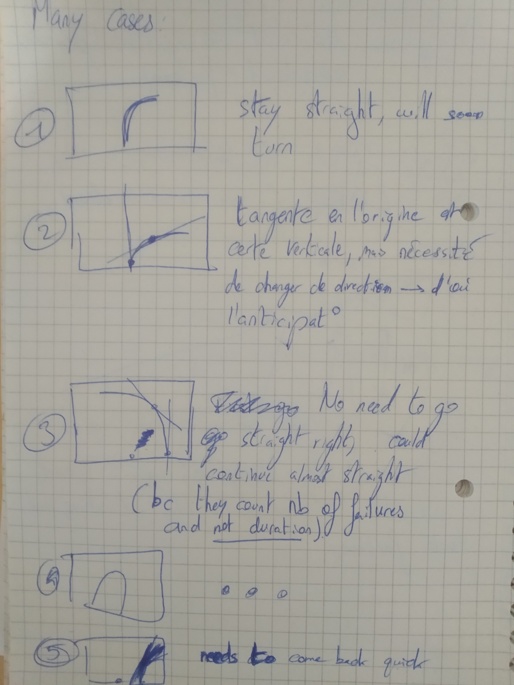

## Device cover, camera orientation, software parameters

Mainly two choices for the position of the device cover: fix it

* under the chest:
    - upsides: no rotation on the z axis while running (only steady body part)
    - downsides: unconfortable to wear

* on the belt (opposite down- and upsides)

Choice is made to fix it **on the belt** and walk. *(To be validated by everyone)*

---

Assumption: No rotation on the z axis while the user is moving is considered *(for now)*

Goal: **put the feet** on the **line** (important to make this clear)

For now, the camera is oriented so that the bottom of the image correspond to the camera's orthogonal projection on the ground (i.e. its vertical point). As the camera's vertical angle is 48.8°, the angle we choose is 25° for now.

---

Because of the latency and the user's speed, we have to anticipate (by not to much) the direction, and thus look further.

There are many cases:

*(Will be reworked later)*

We need to choose a **target point** (TP), or a **target zone**. It should be on the line and could be for example the point on the image which is at 1/4 of the line (beginning from the bottom), or the zone between the 1/4 and the 1/2 of the line on the image. *(Will add images later)*

---

Many methods are then possible:

* We considerate the β angle made by the target point and the user position and the vertical axis of the image (or the average for the target zone). That means we conduct the user directly to the target point.

* More complex approach where we consider two parameters: the α angle between TP tangent and the vertical axis, the d distance of the user to the bottommost point of the line on the image.
The bigger d is, the more you take into account the β angle (as defined upper): it will soften the angle in case 3 but strengthen it in case 5.
We do this because we need to go back on the line and as the time is watched during the evaluation, and a failure could not worsen anything by itself (according to the notation method, they only count the number of times we get out of a line), **it is better to directly get to the target**.
In this approach, the TP (or TZ) maybe needs to be closer.

*(Will add images later)*
